# yasyir_masyal__049__so_soal
tugas matakuliah sistem oprasi 

<table>
        <tr>
            <th>Nama</th>
            <td>: yasyir masy'al</td>
        </tr>
        <tr>
            <th>Kelas</th>
            <td>: Tk 4 B</td>
        </tr>
        <tr>
            <th>Nim</th>
            <td>: 09030282327049</td>
        </tr>
</table>

<ol>
  <li>Melihat I/O, character device, yang ada pada system komputer mengunakan command prompt</li>
    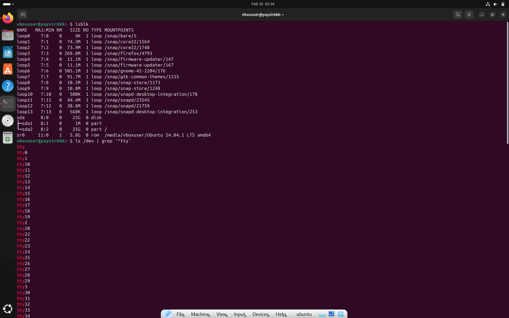
  <li>Membuat sub direktori januari, februari dan maret sekaligus pada direktori latihan5.</li>
    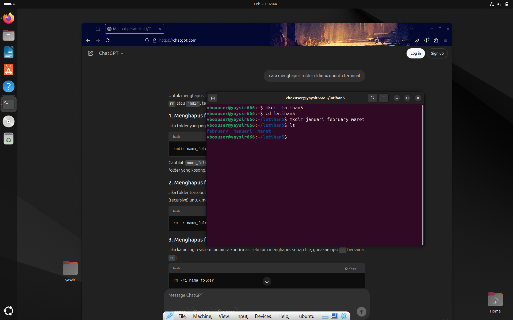
  <li>Membuat file dataku yang berisi nama, nim dan alamat anda pada sub direktori januari
dan copy-kan file tersebut ke sub direktori februari dan maret.</li>
    
    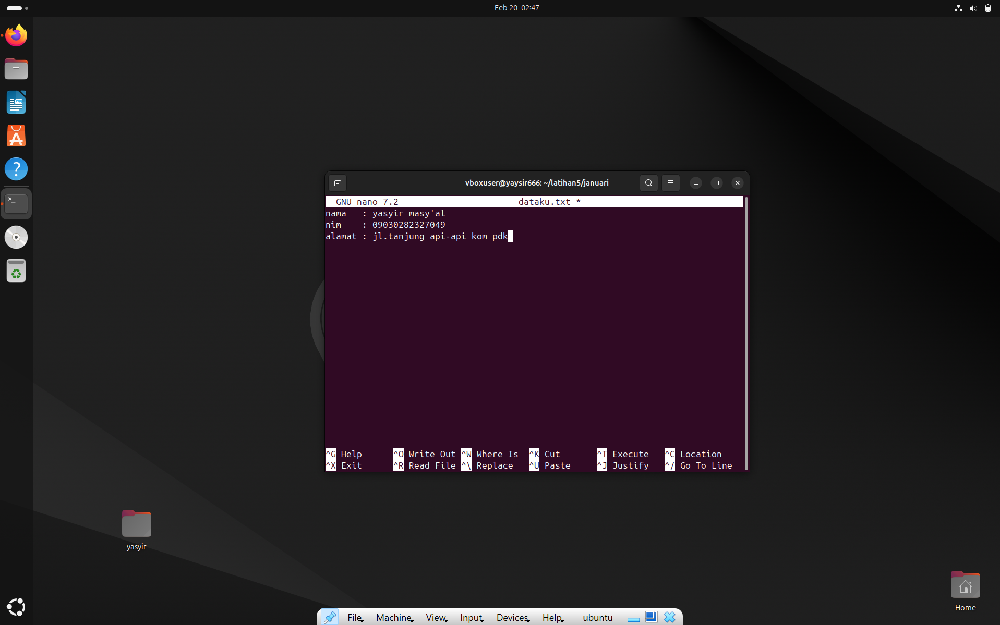
    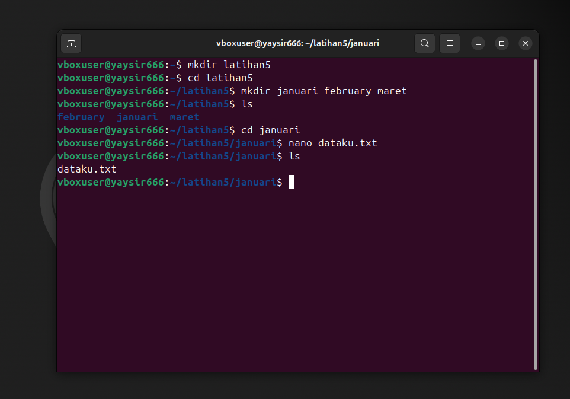
   <li>Mengubah ijin akses file dataku pada sub direktori januari sehingga group dan others
dapat melakukan write.</li>
    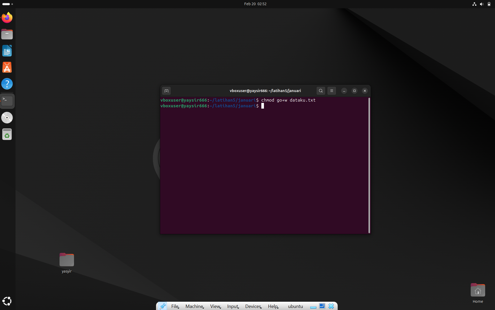
   <li>Mengubah ijin akses file dataku pada sub direktori pebruari sehingga user dapat
melakukan baik write, read maupun execute, tetapi group dan others hanya bisa read
dan execute.</li>
    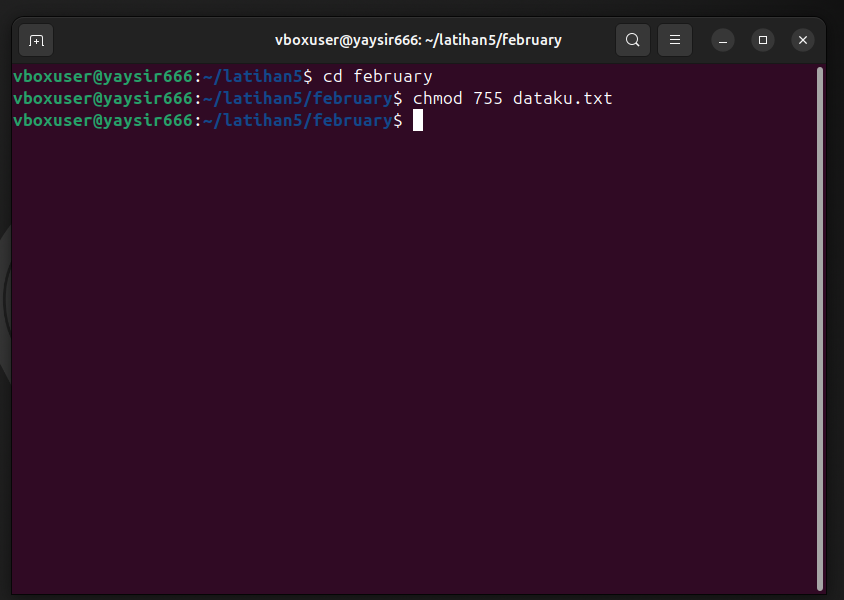
   <li>Mengubah ijin akses file dataku pada sub direktori maret sehingga semua dapat
melakukan write, read dan execute</li>
    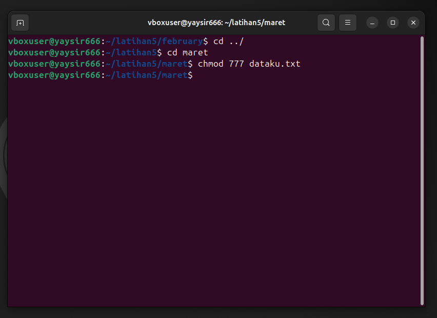
   <li>Menghapus direktori maret.</li>
    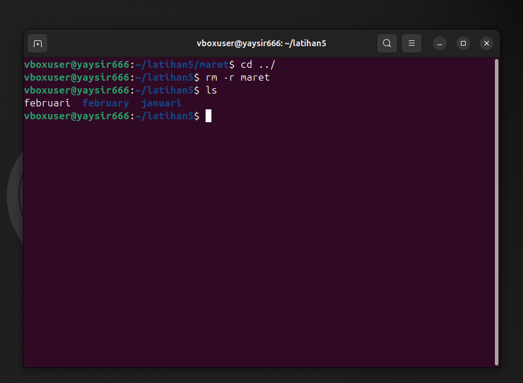
   <li>Mengubah kepemilikan sub direktori februari sehingga user dan group hanya dapat
melakukan read, dan cobalah untuk membuat direktori baru haha pada sub direktori
februari.</li>
    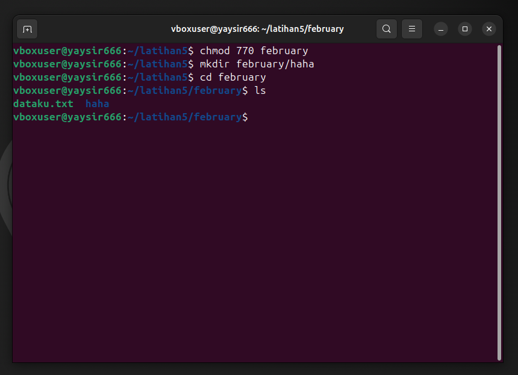
   <li>Modifikasi umask dari file dataku pada sub direktori januari menjadi 027 dan berapakan
nilai default-nya </li>
    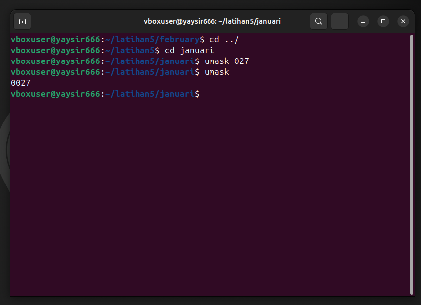
   <li>Membuat link dari file dataku ke file dataku.ini dan file dataku.juga dan dengan perintah
list perhatikan berapa link yang terjadi </li>
    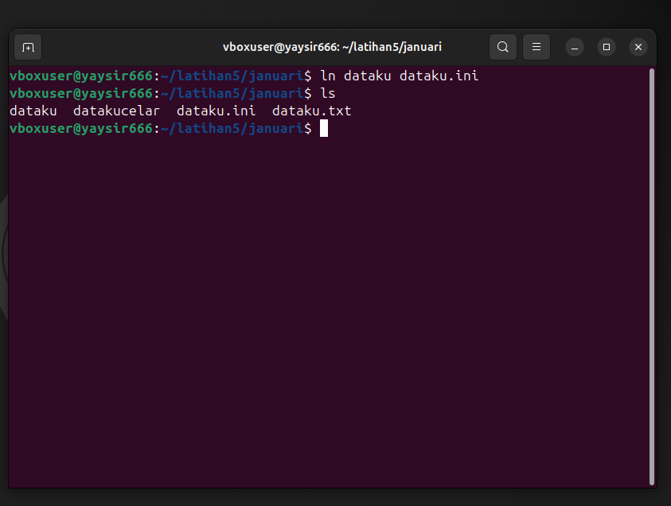
    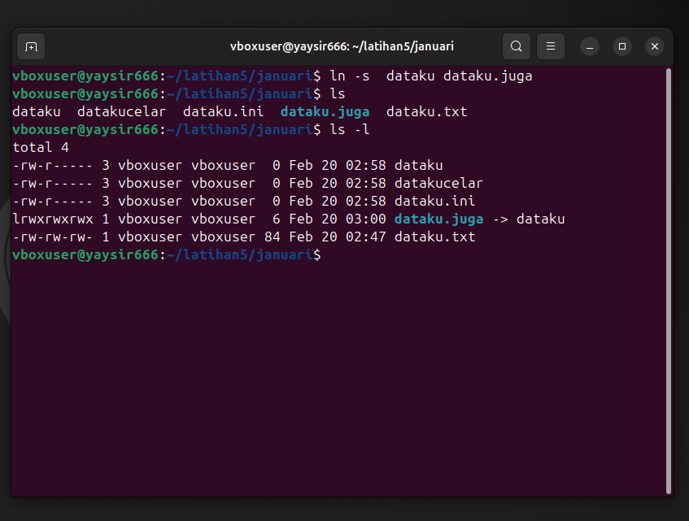
</ol>
